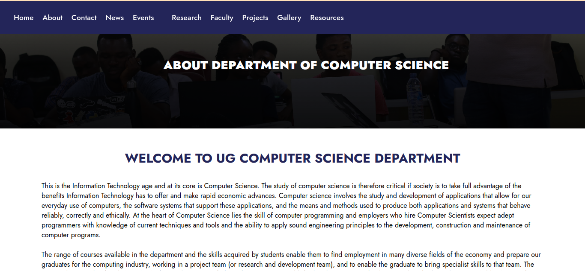
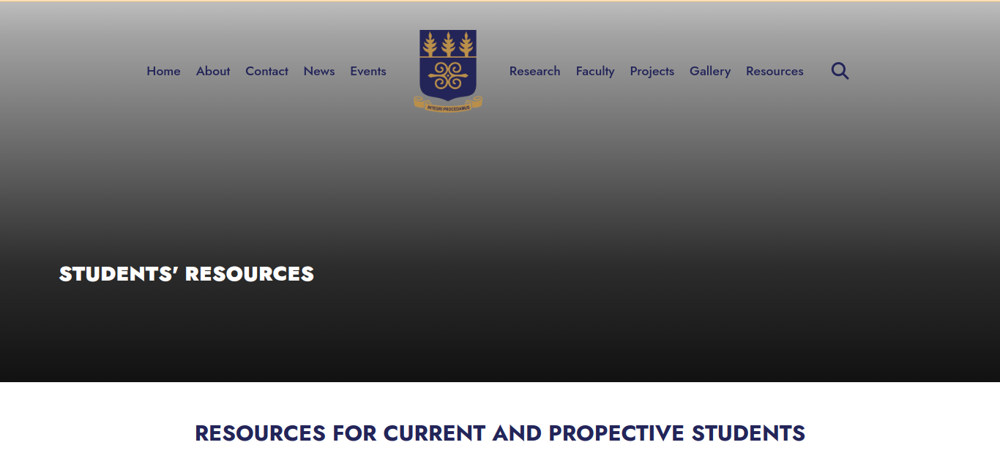

## DCIT_205_IA

### Table of Contents

- [About the Project](#about-the-project)
- [Author](#author)
- [Built With](#built-with)
- [Live demo](#live-demo)
- [Features Implemented](#features-implemented)
- [Getting Started](#getting-started)
  - [Cloning the Repository](#cloning-the-repository)
  - [Running the Website](#running-the-website)
- [Screenshots](#screenshots)
- [Insights and Learnings](#insights-and-learnings)
### About the Project

This project involved the development of a 10-page website for the Computer Science Department. The primary objective was to improve the existing website, emphasizing user-friendliness, navigation, and information representation. The website was built using HTML, CSS, and JavaScript, adhering to the guidelines and restrictions provided in the project requirements.

### Author

- **Your Name:** Esther Osei
- **Student ID:** 11352966

#### Built With
 - HTML
 - CSS
 - Javascript
 
#### Live demo
[Live demo of the project]()


#### Features Implemented

- **Responsive Design:** Ensured the website's compatibility and usability across various devices, ensuring an optimal viewing experience.
- **Structured Pages:** Created 10 distinct pages covering different aspects of the Computer Science Department, such as Home, About, Catalog, Resources, Events, Contact, and more.
- **Enhanced User Interface:** Focused on user-friendly navigation, clear content layout, and engaging visuals to effectively represent the department.

### Getting Started

To view this project locally, follow these steps:

#### Cloning the Repository

Clone this repository to your desired folder:

```sh
  cd my-folder
  git clone https://github.com/OseiEsther/DCIT_205_IA.git
```


#### Running the Website

- Open the `index.html` file in your preferred web browser.

### Screenshots







### Insights and Learnings

- Through this project, I learned a great deal about frontend web development using HTML, CSS, and JavaScript. 
- I have also learn about media queries for responsive designs. 
- I have learn about deploying website on github pages
- I have learn a lot about using CSS grid effectively 
- Overcoming challenges such as implementing responsive design and maintaining consistent styling across pages provided valuable learning opportunities.


